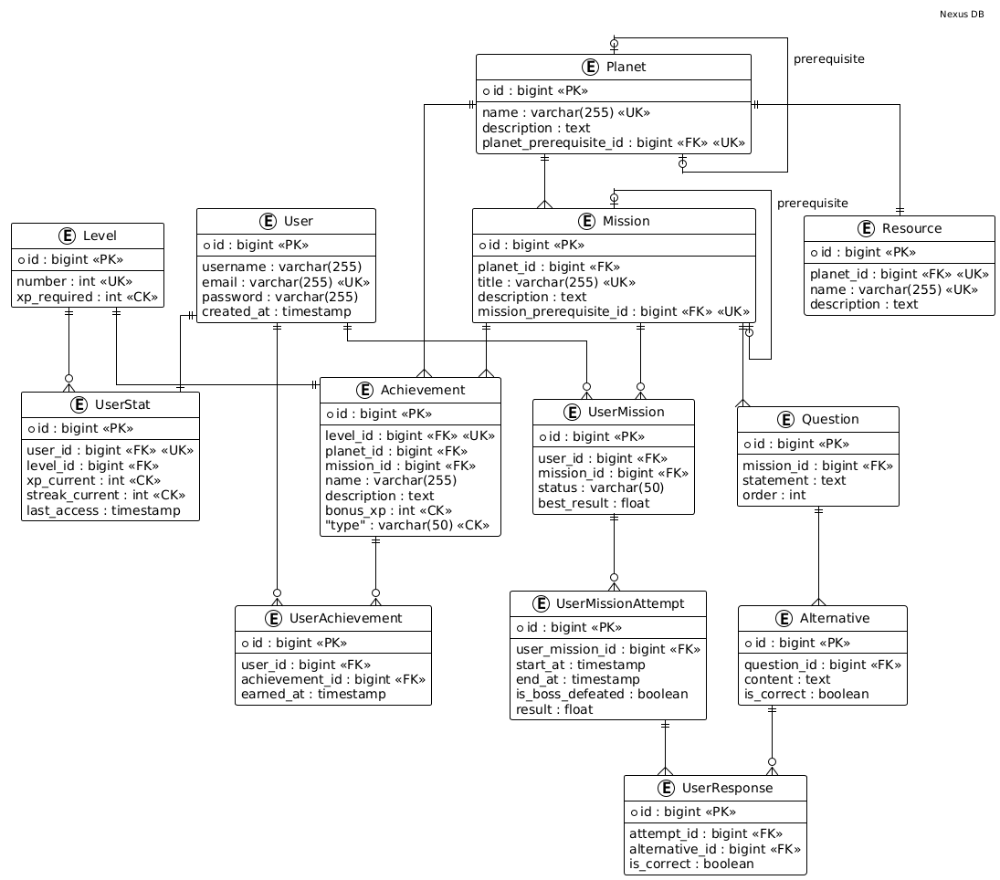

# NEXUS - PostgreSQL

## 1. Convenções de Escrita e Padrões

Para manter a consistência e evitar conflitos entre diferentes bancos de dados (como PostgreSQL e MySQL), as seguintes convenções foram adotadas:

* **Snake Case:** Todos os nomes de tabelas e colunas utilizam letras minúsculas separadas por underscore (ex: `user_mission_attempt`).
* **Uso de aspas:** Todas os nomes de tabelas e nomes de colunas de não referencia utilizam aspas duplas.
* **Identificadores:** Chaves primárias são sempre do tipo `bigint` e utilizam `GENERATED BY DEFAULT AS IDENTITY` para autoincremento. 
* **Integridade:** Uso extensivo de `ON DELETE CASCADE` para garantir que, ao remover um usuário ou missão, os registros históricos dependentes não fiquem "órfãos".
* **Prefixos de Constraints:**
  * `pk_[nome_da_tabela]_[nome_da_coluna]`: Primary Key
  * `fk_[nome_da_tabela]_[nome_da_coluna]`: Foreign Key
  * `uk_[nome_da_tabela]_[nome_da_coluna]`: Unique Key
  * `ck_[nome_da_tabela]_[nome_da_coluna]`: Check Constraint

---

## 2. Entidades e Relacionamentos (Atualizado)

### 2.1 Núcleo de Usuário e Progressão
Responsável por armazenar a identidade dos jogadores, seu nível de experiência e localização exata no mapa do jogo.

* **`user`**: Cadastro fundamental. O `email` permanece como identificador único.
* **`level`**: Tabela de referência que define a régua de progressão através da coluna `xp_required`.
* **`user_stat`**: Extensão do perfil (1:1 com `user`). Agora rastreia não apenas o XP e a *streak*, mas também o **estado atual** do jogador através de chaves estrangeiras para `current_planet_id` e `current_mission_id`.

### 2.2 Estrutura do Mundo e Conteúdo (Missões)
Define a hierarquia pedagógica e os desafios. A lógica de auto-relacionamento (pré-requisitos) foi movida para a lógica de aplicação ou simplificada pela coluna `"order"`.

* **`planet`**: A unidade macro (mundo). Possui uma ordenação global.
* **`mission`**: Desafios dentro de um planeta. Inclui nível de `difficulty` (EASY, MEDIUM, HARD) e a recompensa de XP específica (`xp_reward`).
* **`question`**: Questões vinculadas à missão. Agora inclui suporte nativo a `code_snippet` para contextos de programação/TI.
* **`alternative`**: Opções de resposta com suporte a `feedback_tip` (justificativa para o erro/acerto).

### 2.3 Execução, Histórico e Recursos
Registra a jornada do usuário e os itens coletados durante a exploração.

* **`user_mission`**: Estado de conclusão de uma missão por usuário. Utiliza o domínio `score` (0 a 100) para o `best_result`.
* **`user_mission_attempt`**: Log detalhado de cada tentativa, registrando tempo de execução (`start_at`, `end_at`) e resultado.
* **`user_response`**: Registro de qual alternativa o usuário escolheu para cada pergunta em uma tentativa específica.
* **`resource` / `user_resource`**: Novo sistema de itens/recursos vinculados a planetas que os usuários podem coletar durante a jornada.

### 2.4 Sistema de Conquistas (Achievements)
O sistema foi expandido para ser dinâmico, permitindo que uma conquista seja vinculada a diferentes tipos de objetivos.

* **`achievement`**: Define o troféu, seu tipo (UNLOCK, COMPLETED, COLLECTED) e o bônus de XP. O `scope` define se é algo global do jogo ou atrelado a uma entidade.
* **`achievement_target`**: Tabela técnica que vincula a conquista a um alvo específico (`level`, `mission` ou `planet`) através de um ENUM de tipo de entidade.
* **`user_achievement`**: O histórico de conquistas desbloqueadas pelo jogador.

### Tipos e Domínios Globais
Para garantir a integridade dos dados, o esquema utiliza:
* **`score`**: Domínio decimal que valida valores estritamente entre 0 e 100.
* **Enums**: Padronização de dificuldades, status de missão e tipos de conquistas para evitar estados inválidos no banco.

---

## 3. Matriz de Cardinalidade (Completa e Auditada)

| Entidade A | Entidade B | Tipo | Descrição / Regra de Negócio |
| :--- | :--- | :---: | :--- |
| **`user`** | **`user_stat`** | **1:1** | Vínculo obrigatório e único para cada jogador (extensão de perfil). |
| **`level`** | **`user_stat`** | **1:N** | Define o nível atual do jogador na progressão. |
| **`planet`** | **`user_stat`** | **1:N** | **(Estado)** Indica em qual planeta o jogador está "estacionado". |
| **`mission`** | **`user_stat`** | **1:N** | **(Estado)** Indica qual missão o jogador está tentando no momento. |
| **`planet`** | **`mission`** | **1:N** | Agrupamento de missões por mundo/tema. |
| **`planet`** | **`resource`** | **1:1** | Cada planeta provê um recurso único (`uk_resource_planet`). |
| **`mission`** | **`question`** | **1:N** | O conjunto de desafios que compõe a missão. |
| **`question`** | **`alternative`** | **1:N** | As opções de escolha para cada desafio. |
| **`user_mission`** | **`attempt`** | **1:N** | Histórico de tentativas para bater o recorde da missão. |
| **`attempt`** | **`user_response`** | **1:N** | Rastro de qual alternativa foi escolhida em cada pergunta. |
| **`question`** | **`user_response`** | **1:N** | Garante que a resposta pertence a uma questão válida. |
| **`resource`** | **`user_resource`** | **1:N** | Registra quem coletou o item e quando. |
| **`achievement`** | **`target`** | **1:N** | Uma conquista pode exigir múltiplos alvos (ex: completar 3 planetas). |
| **`achievement`** | **`user_achievement`**| **1:N** | Instância da conquista desbloqueada pelo usuário. |

---

## 4. Regras de Negócio Implementadas (Constraints)

As regras abaixo estão aplicadas diretamente na camada de dados via `CHECK`, `UNIQUE` e `FOREIGN KEY` com integridade composta.

### 4.1 Integridade de Valores e Atributos
* **XP e Evolução:** As colunas `xp_required` (Level), `xp_total` (User Stat), `xp_reward` (Mission) e `bonus_xp` (Achievement) possuem *constraints* que impedem valores negativos.
* **Domínio de Pontuação (Score):** Criado o domínio `score` que valida automaticamente que qualquer nota ou resultado (em `user_mission`, `user_mission_attempt` e `best_result`) esteja estritamente entre **0 e 100**.
* **Consistência Temporal:** Em `user_mission_attempt`, a data de término (`end_at`) deve ser obrigatoriamente igual ou posterior à data de início (`start_at`).

### 4.2 Unicidade e Organização de Conteúdo
* **Hierarquia Planetária:** Cada planeta deve ter um nome único e uma posição na fila (`order`) exclusiva. Dentro de um planeta, não podem existir duas missões com o mesmo nome ou a mesma ordem.
* **Sequência Pedagógica:** Em `question`, a coluna `order` é única por missão, garantindo que o fluxo de perguntas seja sempre linear e sem saltos para o usuário.
* **Alternativas Distintas:** Uma questão não pode ter duas alternativas com o mesmo texto (`uk_alternative_content`).

### 4.3 Rastreabilidade e Estado do Jogador
* **Vínculo de Progresso Único:** Um usuário só pode ter um registro de estatísticas global (`uk_user_stat_user`) e um registro único para cada missão iniciada (`uk_user_mission`), evitando duplicidade de XP ou status.
* **Integridade de Resposta:** A tabela `user_response` utiliza uma **chave estrangeira composta** vinculada a `question_id` e `alternative_id`. Isso impede que o sistema registre uma resposta para a Pergunta A usando uma alternativa que pertence à Pergunta B.
* **Status de Missão:** O campo `status` é restrito pelo tipo enumerado `mission_status`, aceitando apenas `IN_PROGRESS` ou `COMPLETED`.

### 4.4 Regras de Recompensa e Coleta
* **Coleta Única:** Um usuário não pode coletar o mesmo recurso (`user_resource`) ou a mesma conquista (`user_achievement`) mais de uma vez.
* **Alvos de Conquista:** A tabela `achievement_target` garante a unicidade da tríade (Conquista, Tipo de Entidade e ID da Entidade), permitindo que o sistema verifique exatamente qual missão ou nível desbloqueia cada troféu.

---

## 5. Diagrama de Entidade-Relacionamento (ER)

### Como ler o diagrama:

* **`||--||`**: Relacionamento 1 para 1 (Obrigatório).
* **`||--o{`**: Relacionamento 1 para Muitos (Opcional - pode ser zero).
* **`||--|{`**: Relacionamento 1 para Muitos (Obrigatório - ao menos um).
* **`|o--o|`**: Relacionamento opcional de ambos os lados (Auto-referência).
